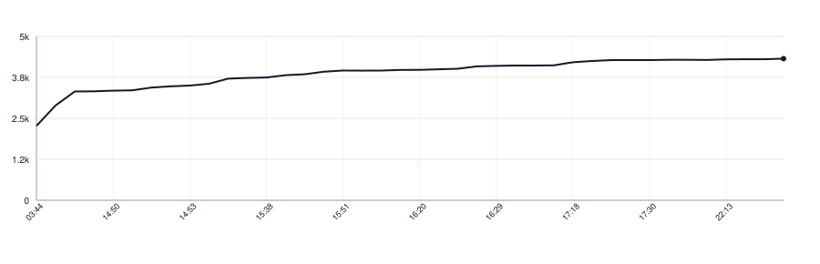

# readaloudkit-kotlin

[](https://github.com/apakabarlabs/readaloudkit-kotlin/actions/workflows/tests.yml)
[](https://apakabarlabs.github.io/readaloudkit-kotlin/)

Decides whether a person reading a printed text aloud said what is written, and
holds that decision in one place so that every side of a product answers the
same way.

A recogniser does not return the text that was read. It returns today's spelling
for an old one, a word boundary in the wrong place, and now and then a different
word for the same sound. What counts as having said a word is therefore a rule,
not a comparison, and a rule that lives in two places drifts: the phone clears a
line the server holds, and nobody can say which is right.

This is a Kotlin/JVM port of [readaloudkit-swift](https://github.com/apakabarlabs/readaloudkit-swift),
with the same names and behaviour. It is built on
[readalign-kotlin](https://github.com/apakabarlabs/readalign-kotlin), as the Swift
library is built on readalign-swift.

## What it decides

- **Whether a word was said.** The recogniser's output is lined up against the
  text, and each pair is the written word itself or a spelling written down for
  the build that misheard it.
- **What a build is allowed to mishear.** `RecognizerQuirks` carries those
  spellings, narrowed where a word is only misheard in one turn of phrase.
- **Where the reader is.** Which line is being read, which words of it are
  already behind, and which word the narration is on.
- **Whether a piece is finished**, and what a stage of a drill still owes.

## Use

```kotlin
import fm.apakabar.readaloudkit.RecognizerQuirks
import fm.apakabar.readaloudkit.SpokenLineTracker
import fm.apakabar.readaloudkit.WordTokenizer

val tracker = SpokenLineTracker(lines = printedLines, quirks = RecognizerQuirks.none, tokenizer = WordTokenizer.latinScript)
val saidEveryWord = tracker.progress(heard = transcript).isComplete
```

The tokenizer is the language's: `WordTokenizer.latinScript` keeps apostrophes and
hyphens inside a word, and a text in another script passes its own. Nothing here picks
one for you.

A written word nothing was heard for is left out of `SpokenWords.check(...).matches`
altogether, so comparing how many matches were faithful with how many there were
does not show that every word was said; `isComplete` does.

## Cases

What the library answers for a given input is written down once, in YAML under
`Tests/ReadAloudKitTests/Resources/` in readaloudkit-swift, and copied into
`src/test/resources/` here with `make sync-yaml`. A test fetches each listed file from
that repository's `main` and fails when the copy differs, so the ports cannot quietly
drift apart.

## Install

The library is published to Maven Central:

```kotlin
repositories {
    mavenCentral()
}

dependencies {
    implementation("fm.apakabar:readaloudkit-kotlin:0.3.0")
}
```

It runs on Java 21 or later, whose `java.text.BreakIterator` splits text into the same
characters as Swift does, and needs no other library for it.

The API is not settled before 1.0 and may change between minor versions.

## Documentation

The [Dokka API reference](https://apakabarlabs.github.io/readaloudkit-kotlin/) is generated from the public Kotlin API and deployed by GitHub Actions.

## Develop

```bash
make test
make lint
make docs
make build
make sync-yaml   # after the cases change in readaloudkit-swift
```

Releases are published by the [Release workflow](https://github.com/apakabarlabs/readaloudkit-kotlin/actions/workflows/release.yml).

## Lines of Code

<picture>
  <source media="(prefers-color-scheme: dark)" srcset=".github/loc-history-dark.svg">
  <source media="(prefers-color-scheme: light)" srcset=".github/loc-history-light.svg">
  
</picture>
